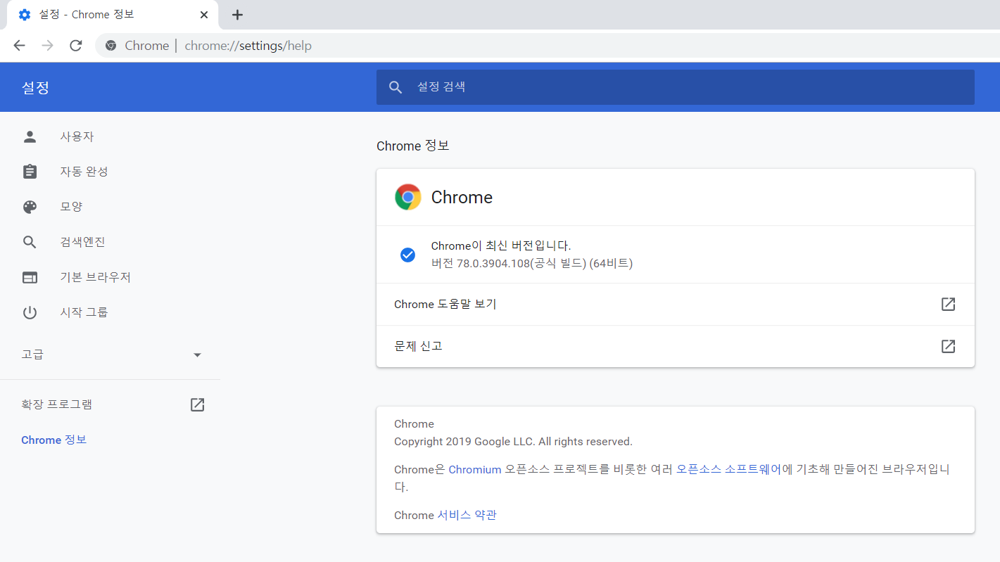
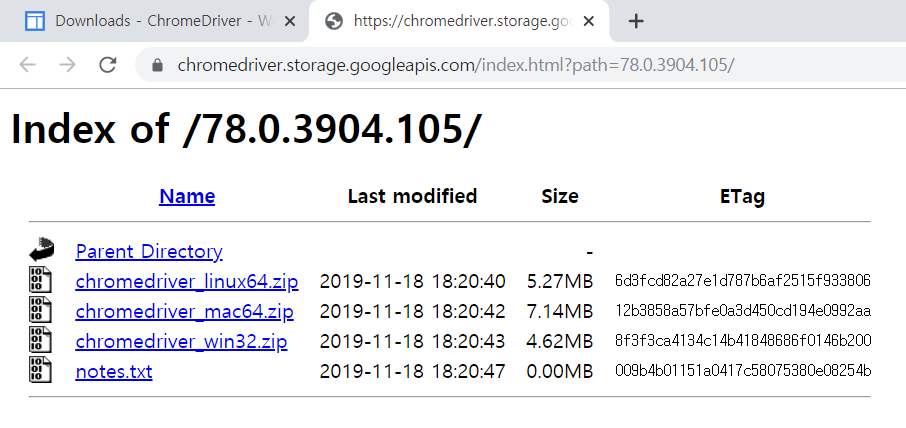

# getjobcrawl 프로젝트
> 취업정보 웹 서비스의 채용공고 게시판 크롤링

### 관련 library 설치
> 웹 크롤링시 아래의 라이브러리 사용할 예정
> 설치 버전은 requirements.txt 참조

- [x] 웹 페이지 이동, 동적 페이지 로드 : Selenium
- [x] html 파싱 : BeautifulSoup
- [ ] 데이터 저장 : PyMongo

### Chrome 드라이버 다운로드

> Selenium은 Web Browser 드라이버 조작시 각 제조사별 driver를 사용하는데, 개발 환경에 설치된 Web Browser 버전 별로 지원하는 드라이버가 다르므로 아래와 같이 확인이 필요함

* 설치된 크롬 브라우저 버전 확인  

  
[settings link](chrome://settings/help)

* 크롬 드라이버 다운로드  

  
[download link](https://chromedriver.chromium.org/downloads)  

